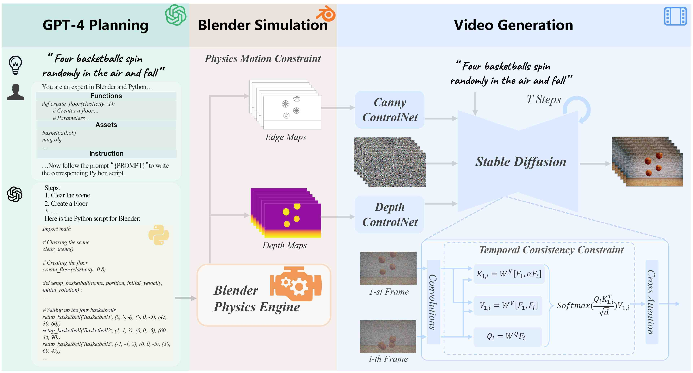

# :basketball: GPT4Motion: Scripting Physical Motions in Text-to-Video Generation via Blender-Oriented GPT Planning

https://github.com/jiaxilv/GPT4Motion/assets/67190845/f4309a24-fb8d-4800-8709-5794adf338e3


*We introduce GPT4Motion, a training-free framework that leverages the planning capability of large language models such as GPT, the physical simulation strength of Blender, and the excellent image generation ability of text-to-image diffusion models to enhance the quality of video synthesis.*


[**Paper**](https://arxiv.org/abs/2311.12631) | [**Project Website**](https://gpt4motion.github.io/) 


Jiaxi Lv\*, Yi Huang\*, Mingfu Yan\*, Jiancheng Huang, Jianzhuang Liu, Yifan Liu, Yafei Wen, Xiaoxin Chen, Shifeng Chen

Shenzhen Institute of Advanced Technology, Chinese Academy of Sciences,  University of Chinese Academy of Sciences, VIVO AI Lab


## News!!! :fire::fire::fire:

* 2024-06-18   :trophy::trophy::trophy: Congratulations! **GPT4Motion was received the Best Paper Runner-Up Award at the CVPR 2024 PBDL workshop.**

* 2024-04-16  We released the code for GPT4Motion. 

* 2024-04-09  GPT4Motion was accepted by the CVPR 2024 PBDL workshop! 

* 2023-11-28  GPT4Motion was covered by [Synced](https://www.jiqizhixin.com/articles/2023-11-28-2).

* 2023-11-22  GPT4Motion was recommended by [AK](https://twitter.com/_akhaliq/status/1727172666455413187) and included in [Hugging Face's daily papers](https://huggingface.co/papers/2311.12631). 

* 2023-11-21  The GPT4Motion paper was uploaded to [arXiv](https://arxiv.org/abs/2311.12631).

## Overview



First, the user prompt is inserted into our designed prompt template. Then, the Python script generated by GPT-4 drives the Blender physics engine to simulate the corresponding motion, producing sequences of edge maps and depth maps. Finally, two ControlNets are employed to constrain the physical motion of video frames generated by Stable Diffusion, where a temporal consistency constraint is designed to enforce the coherence among frames.


## Performance

### Comparisons with Baselines


https://github.com/jiaxilv/GPT4Motion/assets/67190845/83ce746d-f2e0-4e40-bc0d-cd572b6b867e

Comparison of the video results generated by different text-to-video models with the prompt *"A white flag flaps in the wind"*.


https://github.com/jiaxilv/GPT4Motion/assets/67190845/9780d680-888f-4fe9-8371-cbc0a1c69801

Comparison of the video results generated by different text-to-video models with the prompt *"Water flows into a white mug on a table, top-down view*.


### Controlling Physical Properties


https://github.com/jiaxilv/GPT4Motion/assets/67190845/0724e560-606c-409e-b6ec-038141a6055c


GPT4Motion's results on basketball drop and collision. 


https://github.com/jiaxilv/GPT4Motion/assets/67190845/71513144-57ba-4743-807c-6f7ebd9c9eb2

GPT4Motion's results on "A white flag flags in light or the or strong wind".


https://github.com/jiaxilv/GPT4Motion/assets/67190845/b3f2e66c-65b4-4a2f-b656-dd163e28c5b7


GPT4Motion's results on "A white T-shirt flutters in light or the or strong wind".


https://github.com/jiaxilv/GPT4Motion/assets/67190845/753a7a15-28a2-40cf-818e-dd96e29713c7


GPT4Motion's results on "Water or Viscous or Very viscous flows into a white mug on a table, top-down view".


## Directory of our code

For ease of reading, we list our directory structure.

```
├── data
│   └── basketball
│       └── A basketball free falls in the air
│           ├── depth
│           │   ├── depth_0000.png
│           │   └── ... (more depth images)
│           └── freestyle
│               ├── canny_0000.png
│               └── ... (more canny images)
├── PhysicsGeneration
│   ├── BlenderTool
│   │   ├── assets
│   │   │   └── basketball.obj
│   │   ├── __init__.py
│   │   └── utils.py
│   ├── prompt_for_GPT4.txt
│   └── script.py
├── README.MD
└── VideoGeneration
    ├── config
    │   └── basketball.yaml
    ├── main.py
    ├── requirements.txt
    └── utils
        ├── Cross_Frame_Attention.py
        ├── __init__.py
        └── utils_all.py
```
- `data`: This directory stores the data used in the project.
  - `basketball`: A subdirectory specifically for basketball-related data.
    - `A basketball free falls in the air`: Contains data for a scenario where a basketball is free-falling.
      - `depth`: Contains depth images.
      - `freestyle`: Contains canny images.
- `PhysicsGeneration`: This directory contains the complete prompt for GPT-4 and the code to obtain depth maps and edge maps rendered through Blender.
- `VideoGeneration`: This directory contains the code for generating a video using depth maps and edge maps generated by Blender.

## Reproducing Our Work

### Generation of Motion Edge Maps and Depth Maps with GPT-4 and Blender

Please install **Blender 3.6** according to https://www.blender.org/download/. 

```shell
cd PhysicsGeneration
```
Please copy the prompt from "prompt_for_GPT4.txt" to GPT-4 and add the following prefix to the Python code generated by GPT-4:
```Python
import bpy
import os
import math
import random
from random import uniform
import mathutils

from sys import path
path.append(bpy.path.abspath("./"))
from BlenderTool.utils import *

ASSETS_PATH = 'BlenderTool/assets/'
```
You will get a Python file like "script.py", please use the following commands to generate the edge and depth maps:
```shell
blender -b -P script.py
```
The generated edge maps and depth maps are saved are saved in "../data/new/" folder.

### Video Generation

Please move to the "VideoGeneration" folder and install the corresponding environment:

```shell
cd ../VideoGeneration/
conda create -n GPT4Motion python=3.9
conda activate GPT4Motion
pip install -r requirements.txt
```

You can generate videos based on our pre-existing depth and edge maps by following the instructions below:

```shell
python main.py config/basketball.yaml
```
The generated results are shown below:


https://github.com/jiaxilv/GPT4Motion/assets/67190845/cb0b2b9d-b2ec-44b1-a6cd-4076bfaede8d

